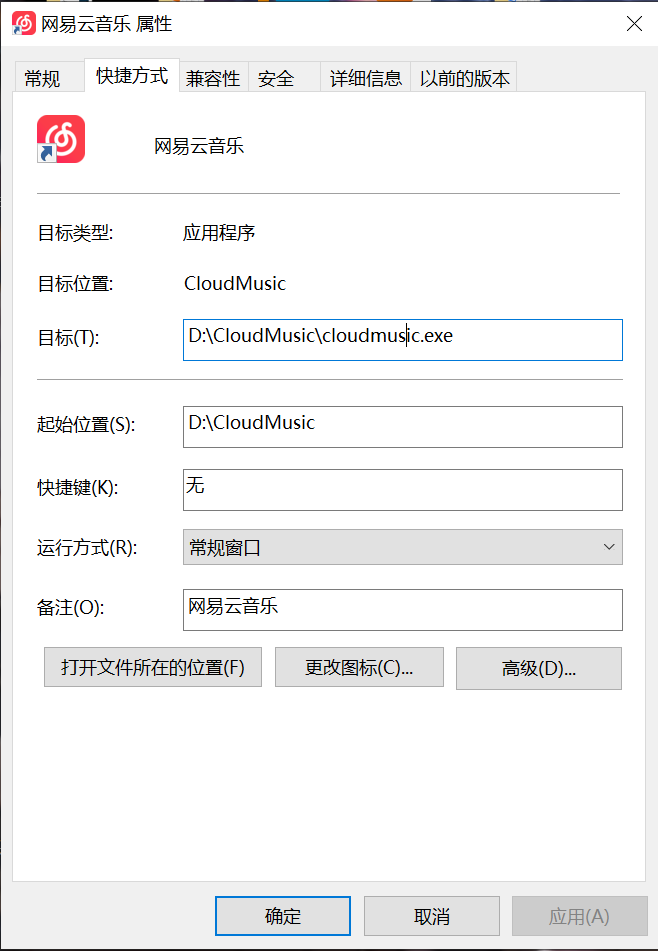

# 系统功能模块设计文档
## 一、远程控制模块（核心模块）
### 1、功能模块说明
    本课题软件的核心功能依赖开源项目Free RDP提供的指令（前期为指令，后续有时间切换为接口）
    ，在国产OS上（目前以UOS开发）能够远程控制Windows系统，那么这个这个远程控制
    根据类型分为两种：
    1、远程桌面的控制
    2、远程软件的控制
    实际上这两个都依托于Free RDP指令，只是2在1的基础上追加了一段指令以达到对远端Windows
上的某个软件进行远端投射并使用。此指令需要输入远端设备的IP、Windows本地账户和密码（暂且必
须是），才能够远端地控制设备。
### 2、操作逻辑
    在实际软件的操作逻辑中为：用户新添加一台远端设备，先输入该远端设备的IP、账号、密码
后保存并连接远端设备，过一会便会弹出一个远端设备的窗口。
## 二、远程应用管理模块
### 1、功能模块说明
    本课题诸多模块中仅次于核心模块的就是本模块，主要是因为是涉及到核心模块的第二类控制，
第二类如何做到单个应用的远程控制呢？Free RDP的拓展指令是使用应用在Windows的别名，注意这和
我们在桌面上看到的快捷方式的名字，例如网易云：
]
    由上面看出，大家平时使用的网易云是有两个名字，第一个名字自然就是网易云，另一个其实就是程
序启动的程序名称"cloudmusic"，也就是在Free RDP中到的别名，那也就是说其实Free RDP能够单个应
用控制也就同通过启动对应的程序来是是实现启动对应应用，其实本课题软件能够实现远程应用卸载也是
这个道理，一般的应用程序安装完之后会跟着一个Uninstall程序（有的程序可能名字不一样），用于卸载
程序，那同理使用这个程序的名字当成Free RDP的别名也就能够实现远程的卸载，安装同理。
