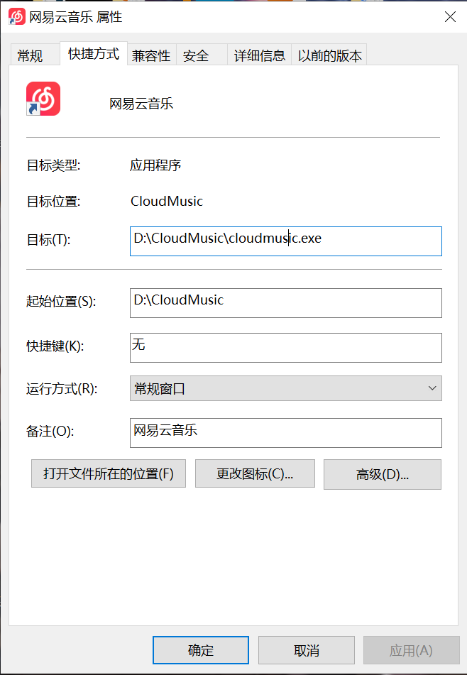

# 系统功能模块设计文档
## 一、远程控制模块（核心模块）
### 1、功能模块说明
    本课题软件的核心功能依赖开源项目Free RDP提供的指令（前期为指令，后续有时间切换为接口）
    ，在国产OS上（目前以UOS开发）能够远程控制Windows系统，那么这个这个远程控制
    根据类型分为两种：
    1、远程桌面的控制
    2、远程软件的控制
    实际上这两个都依托于Free RDP指令，只是2在1的基础上追加了一段指令以达到对远端Windows
    上的某个软件进行远端投射并使用。此指令需要输入远端设备的IP、Windows本地账户和密码（暂且必
    须是），才能够远端地控制设备。
### 2、操作逻辑
    在实际软件的操作逻辑中为：用户新添加一台远端设备，先输入该远端设备的IP、账号、密码
后保存并连接远端设备，过一会便会弹出一个远端设备的窗口。
## 二、远程应用管理模块
### 1、功能模块说明
    本课题诸多模块中仅次于核心模块的就是本模块，主要是因为是涉及到核心模块的第二类控制，
    第二类如何做到单个应用的远程控制呢？Free RDP的拓展指令是使用应用在Windows的别名，
    注意这和我们在桌面上看到的快捷方式的名字，例如网易云：

- 

    由上面看出，大家平时使用的网易云是有两个名字，第一个名字自然就是网易云，另一个其实就是程
    序启动的程序名称"cloud music"，也就是在Free RDP中到的别名，那也就是说其实Free RDP能够单个应
    用控制也就同通过启动对应的程序来是是实现启动对应应用，其实本课题软件能够实现远程应用卸载也是
    这个道理，一般的应用程序安装完之后会跟着一个Uninstall程序（有的程序可能名字不一样），用于卸载程序，那同理使用这个程序的名字当成Free RDP的别名也就能够实现远程的卸载，安装同理。
### 2、操作逻辑
    这个应用管理的操作有点复杂，对于第一次远程控制的设备，用户可以获取远端Windows设备上桌面的应用（暂且是桌面上的，这部还是挺复杂，要去Windows内部获取应用列表还有卸载程序所在位置（微软官方采用注册表）），这里还需要条件编译，这部分操作是针对Windows系统的，其他部分则无需。那获取到这些数据还要
    传输，传输协议自然是TCP协议，数据结构具体看具体的设计文档。

## 三、远程控制配置模块
### 1、功能模块说明
    这个其实就是针对这个远程控制连接远端设备的过程中一些参数调整，在Free RDP协议中也就是多一个指令的事，下面列出可以调整的配置：

| 参数说明                                                     |
| ------------------------------------------------------------ |
| /v: 主机IP地址                                               |
| /u: 登录账号                                                 |
| /p: 登录密码                                                 |
| /f 全屏显示                                                  |
| /port:3389 端口定义                                          |
| /version 版本查询                                            |
| /help 帮助查询                                               |
| /bpp:[8/16/24/32] 画面效果和流畅度                           |
| /sound:sys:pulse,latency:100 音频输出                        |
| /microphone:sys:pulse 音频输入，麦克风                       |
| /rfx 启用RemoterFX显示特性                                   |
| /gdi:[hw/sw] 画面绘制模式（hw为终端、sw为远程服务器）        |
| +drives 本地磁盘映射                                         |
| /video 开启视频增强                                          |
| /usb:auto 开启USB重定向，包含U盘、打印机、UK等支持USB功能    |
| /gfx:AVC444 启用AVC/H264编码（附带+async-update参数效果更加） |

本课题软件也的确根据上面的表给予用户一些能够选配的参数配置。

### 2、操作逻辑
    在设置中心中设定远端控制设备的相关选项配置，勾选后，正常开启远程控制即可（暂不支持使用中打开，可能需要重启画面）

